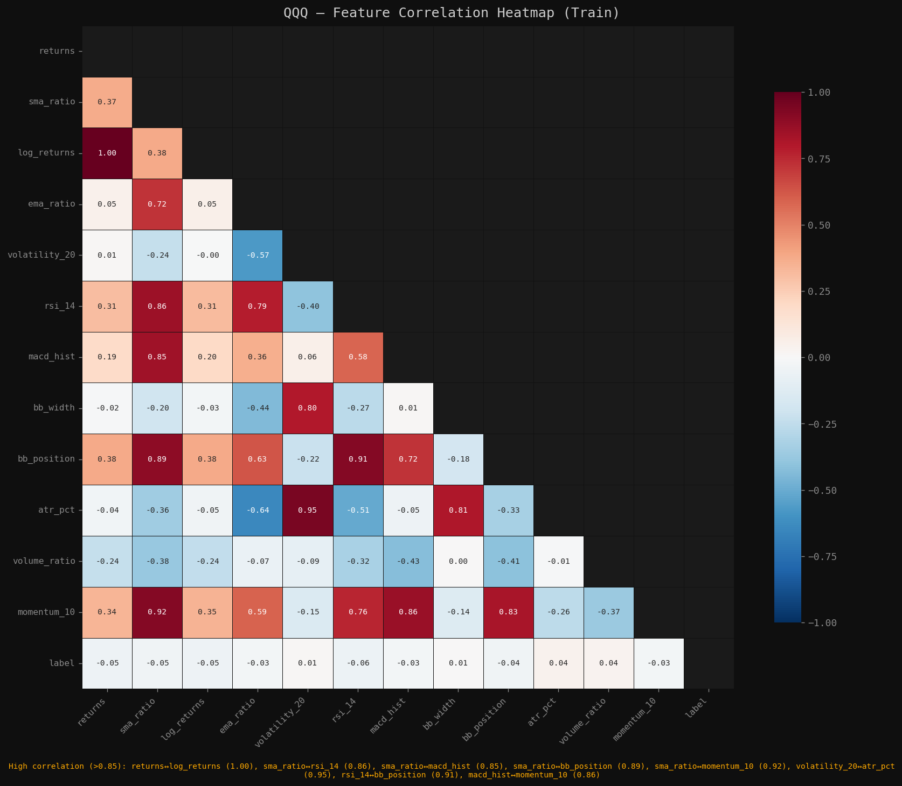
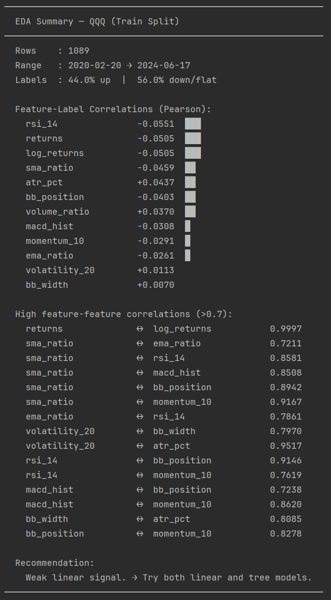
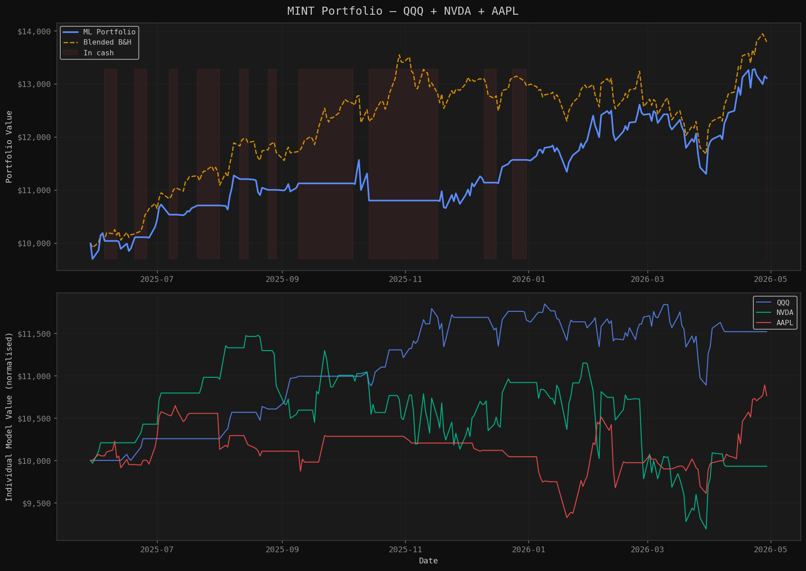
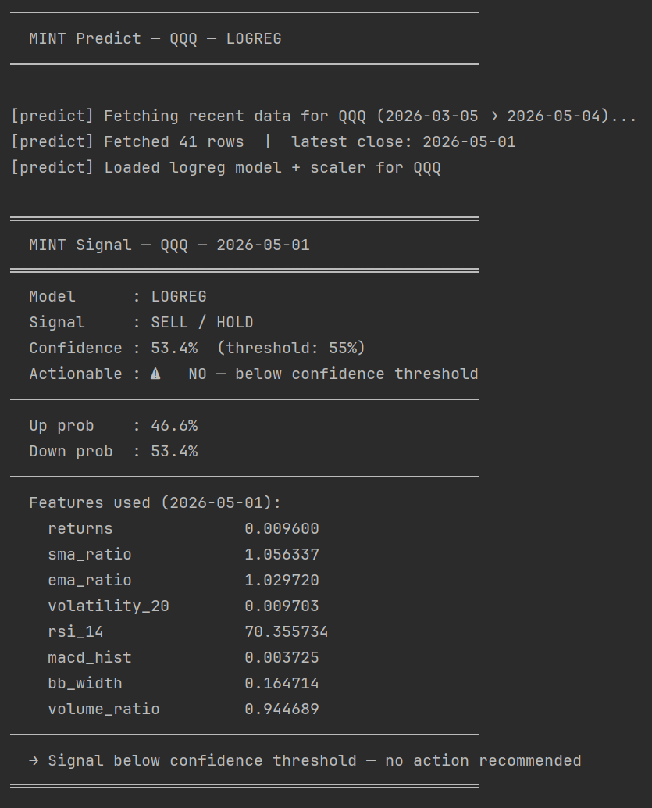

# MINT — Machine Intelligence for Trading

A pipeline for training ML models that predict next-day price direction, and simulating how those signals would perform as a portfolio.

---

## What it does

The starting question was simple: could a model tell me whether a stock was going to go up or down tomorrow?

The problem is that "a stock" isn't specific enough — you need a separate model per ticker, since each one has its own volatility, behavior, and optimal feature set. That means for every new ticker: new data, new preprocessing, new feature selection, new training run, new evaluation. Do that a few times and it gets tedious fast.

MINT is the answer to that tedium. The entire workflow — data fetching, preprocessing, feature engineering, training, backtesting — is driven from a single config file. Adding a new ticker means copying a config block and running the same scripts. Nothing else changes.

The second question was: if you let a portfolio run entirely on those model signals, does it actually grow? That required a simulation layer, so MINT ships one — multi-asset, with transaction costs, operating only on the test split the models never saw during training.

```
fetch → preprocess → eda → preprocess → train → evaluate → portfolio
```

---

## Pipeline

| Script          | What it does                                                   |
|-----------------|----------------------------------------------------------------|
| `fetch.py`      | Downloads raw OHLCV data via yfinance                          |
| `preprocess.py` | Engineers features, creates labels, splits train/val/test      |
| `eda.py`        | Correlation analysis and feature selection plots               |
| `train.py`      | Trains and saves a model + scaler                              |
| `evaluate.py`   | Backtests and generates performance plots                      |
| `portfolio.py`  | Multi-asset portfolio simulation across all configured tickers |
| `predict.py`    | Generates a live Buy/Sell signal for tomorrow's open           |

---

## Quickstart

```bash
# 1. Fetch data (optional — preprocess.py will fetch automatically if needed)
python fetch.py --ticker QQQ --start 2018-01-01

# 2. Preprocess — engineers all 12 features, creates train/val/test splits
python preprocess.py --ticker QQQ

# 3. EDA — inspect feature correlations, drop redundant ones in config.py
python eda.py --ticker QQQ

# 4. Rerun preprocess with trimmed feature set from config.py
python preprocess.py --ticker QQQ

# 5. Train
python train.py --ticker QQQ --model logreg

# 6. Evaluate — backtest on test split, generates plots
python evaluate.py --ticker QQQ --model logreg

# 7. Portfolio simulation — uses default_model set per ticker in config.py
python portfolio.py
```

---

## Configuration

Everything lives in `config.py`. To add a new ticker, copy and paste the following template and edit:

```python
"QQQ": {  # change to your target ticker

    "data": {
        "label_threshold": 0.003,  # min next-day return to label as "up"
        "train_ratio": 0.70,
        "val_ratio":   0.15,

        # Active features passed to the model.
        # Edit after running eda.py to drop redundant ones.
        "features": [
            "returns",
            "sma_ratio",
            "log_returns",
            "ema_ratio",
            "volatility_20",
            "rsi_14",
            "macd_hist",
            "bb_width",
            "bb_position",
            "atr_pct",
            "volume_ratio",
            "momentum_10",
        ],
    },

    "logreg": {
        "C": 0.1,  # tune as needed
        "max_iter": 1000,
        "class_weight": "balanced",
    },

    "randomforest": {  # tune or remove if not using
        "n_estimators": 200,
        "max_depth": 6,
        "min_samples_split": 20,
        "min_samples_leaf": 10,
        "max_features": "sqrt",
        "class_weight": "balanced",
        "random_state": 42,
    },

    "default_model": "logreg",  # model used by portfolio.py
},
```

Model hyperparameters are set per ticker in `config.py`. No touching the training code.

---

## Feature Universe

All features are engineered from raw OHLCV — no external data required. After running `eda.py`, redundant features (correlation > 0.85) are dropped from each ticker's config.

| Feature         | Description                               |
|-----------------|-------------------------------------------|
| `returns`       | Daily close-to-close return               |
| `log_returns`   | Log return (often redundant with returns) |
| `sma_ratio`     | Close / 20-day SMA                        |
| `ema_ratio`     | 12-day EMA / 26-day EMA                   |
| `volatility_20` | 20-day rolling return std                 |
| `rsi_14`        | 14-day Relative Strength Index            |
| `macd_hist`     | MACD histogram normalised by close        |
| `bb_width`      | Bollinger Band width                      |
| `bb_position`   | Close position within Bollinger Bands     |
| `atr_pct`       | ATR normalised by close                   |
| `volume_ratio`  | Volume / 20-day average volume            |
| `momentum_10`   | 10-day price momentum                     |

---

## Feature Selection

After running `eda.py`, the correlation heatmap and terminal summary identify redundant features. Anything above 0.85 correlation with another feature is a candidate to drop — keeping both adds noise without adding information.



```bash
python eda.py --ticker QQQ
```



For QQQ, four features were dropped after EDA:
- `log_returns` — 0.9997 correlation with `returns`
- `momentum_10` — 0.9167 correlation with `sma_ratio`
- `bb_position` — 0.9146 correlation with `rsi_14`
- `atr_pct` &nbsp;&nbsp;&nbsp;&nbsp;&nbsp;&nbsp;&nbsp;— 0.9517 correlation with `volatility_20`

---

## Models

| Model          | Notes                                                                              |
|----------------|------------------------------------------------------------------------------------|
| `logreg`       | Logistic Regression — strong baseline, performs well on low-signal financial data  |
| `randomforest` | Random Forest — useful for non-linear regimes, tune carefully to avoid overfitting |

Logistic Regression consistently outperformed Random Forest in testing — simpler models tend to handle noisy financial data better than complex ones.

To add a new model (e.g. LightGBM): add its hyperparameters to `config.py` and a build branch in `train.py`'s `build_model()`. Nothing else changes.

---

## Portfolio Simulation Results

Simulation period: **May 2025 → May 2026** — test split only, data the models never saw during training.

| Metric            | ML Portfolio | Blended B&H |
|-------------------|--------------|-------------|
| Total Return      | +31.07%      | +37.92%     |
| Annualized Return | +34.33%      | +42.01%     |
| Sharpe Ratio      | 1.628        | —           |
| Max Drawdown      | -10.37%      | —           |
| Days Invested     | 60.6%        | 100%        |

The portfolio trailed buy-and-hold on raw return, but was in cash roughly 40% of the time — sitting out uncertain periods rather than holding through them. Whether that tradeoff is worthwhile depends on what you're optimizing for.



The top panel shows the combined ML portfolio vs the blended buy-and-hold baseline. The bottom panel shows each ticker's individual model performance normalized to the same starting capital.

---

## Live Signal

Run after market close to get tomorrow's signal:

```bash
python predict.py --ticker QQQ --model logreg
```



The `--confidence` flag sets the minimum probability threshold to act on a signal. Below it, the signal prints but is marked as not actionable.

---

## Project Structure

```
mint/
├── .gitignore
├── README.md
├── requirements.txt
├── assets/                   # screenshots and plots for README
├── config.py                 # single source of truth — all settings per ticker
├── backtest.py               # simulation engine (used by evaluate + portfolio)
├── eda.py                    # exploratory analysis + feature selection
├── evaluate.py               # backtest + performance plots
├── fetch.py                  # data download
├── portfolio.py              # multi-asset portfolio simulation
├── predict.py                # live signal generation
├── preprocess.py             # feature engineering + splits
├── train.py                  # model training
├── data/
│   ├── raw/                  # downloaded OHLCV
│   ├── splits/               # train / val / test CSVs
│   ├── processed/            # full processed dataset
│   └── plots/                # all generated plots
├── models/                   # saved model + scaler pairs (.pkl)
└── docs/
    ├── devlog.md             # development log
    └── models.md             # model notes and results
```

---

## Notes

- **No lookahead bias** — signals generated at close execute at the following day's open. The test split is never touched during training or feature selection.
- **Transaction costs** — portfolio simulation applies 0.1% per trade.
- **Labels** — binary classification: 1 if next-day return exceeds `label_threshold`, else 0. Threshold is tuned per ticker based on typical volatility.
- **Scaling** — `StandardScaler` fitted on train split only, applied to val and test.

---

## Dependencies

```bash
pip install -r requirements.txt
```

or manually:

```bash
pip install yfinance pandas numpy scikit-learn pandas-ta matplotlib seaborn joblib
```

Python 3.11+
